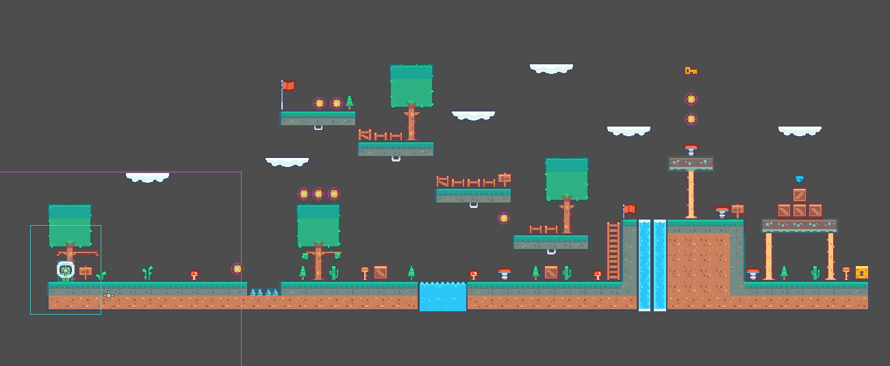

# Una Guía Clara para Principiantes y Niños

## Descripción:
¡Bienvenido al fascinante mundo de Godot! En este proyecto podrás crear un emocionante juego con Godot Engine, siguiendo una guía diseñada para enseñar a los entusiastas y a los niños los conceptos básicos de desarrollo de juegos de manera clara y divertida.

🎮 Proyecto de Juego Interactivo: Experimenta directamente con el juego creado en Godot.
📚 Documentación en PDF: Descarga y aprende a tu propio ritmo con guías detalladas.
🤖 Iniciación Amigable: Diseñado para hacer que el desarrollo de juegos sea accesible y emocionante para todos.

Los PDF/GUIA están en la siguiente carpeta:

```./Docs```

Ejemplo


>[!CAUTION]
>El proyecto aún está en desarrollo; se pueden aplicar cambios que modifiquen parcial o totalmente todo el proyecto.